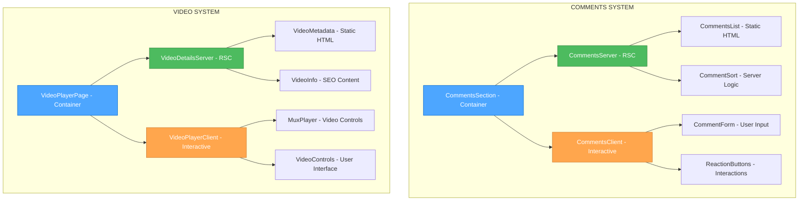
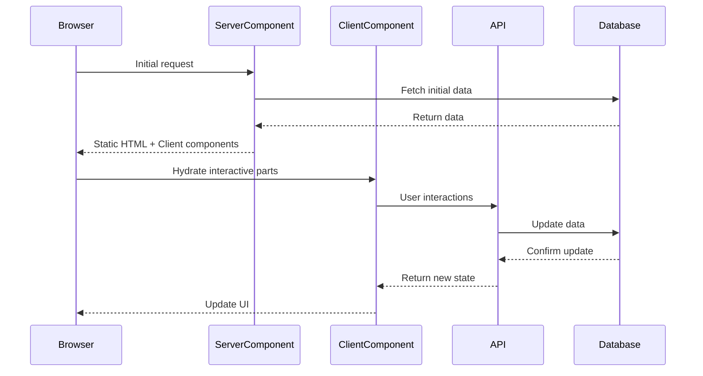

# 🎨🎨🎨 ENTERING CREATIVE PHASE: ARCHITECTURE DESIGN 🎨🎨🎨

## Component Splitting Architecture Creative Phase

**Task:** Splitting Large Components (Suspense & SSR)  
**Focus:** Server/Client Component Boundary Architecture  
**Date:** 2025-01-06  
**Phase:** Architecture Design

---

## 🎯 PROBLEM STATEMENT

**Context:**

- Current CommentsSection (196 lines) is entirely client-side, missing SEO benefits
- VideoPlayerPageClient renders static metadata client-side, delaying initial paint
- Monolithic Suspense boundaries prevent granular loading optimization
- Server-side rendering opportunities are underutilized for static content

**Technical Requirements:**

- Maintain backward compatibility with existing APIs
- Preserve all interactive functionality and user experience
- Improve First Contentful Paint (FCP) and SEO scores
- Enable progressive enhancement and granular loading states
- Support user authentication and personalized content

**Constraints:**

- Must work with Next.js App Router and React Server Components
- Supabase client/server SDK compatibility required
- Existing comment/video APIs should remain functional
- No breaking changes to component prop interfaces

---

## 🏗️ COMPONENT ANALYSIS

### CommentsSection Component (Current)

**Role:** Complete comment system management  
**Responsibilities:**

- Comment fetching and display (SEO opportunity)
- Comment forms and submission (must remain client)
- Reaction buttons and state (must remain client)
- Sorting and filtering (can be server-side)
- Authentication handling (can be server-side)

### VideoPlayerPageClient Component (Current)

**Role:** Video page orchestration  
**Responsibilities:**

- Video metadata display (SEO opportunity)
- Mux player rendering (must remain client)
- User authentication state (can be server-side)
- Layout and styling (can be server-side)

**Key Interactions:**

- Comment posting → API calls → Database updates
- Reaction toggling → Optimistic UI → Database sync
- Video loading → Mux player → Playback controls
- User auth → Conditional rendering → Personalized content

---

## 🔄 ARCHITECTURE OPTIONS ANALYSIS

### Option 1: Hybrid Server/Client Architecture

**Description:** Split components into separate server and client parts with clear boundaries

**Architecture:**

```
CommentsSection (Server)
├── CommentsServer (RSC) - Static comment list, SEO-optimized
└── CommentsClient (Client) - Forms, reactions, interactions

VideoPlayerPage (Server)
├── VideoDetailsServer (RSC) - Title, description, metadata
└── VideoPlayerClient (Client) - Mux player, controls
```

**Pros:**

- ✅ Clear separation of concerns (static vs interactive)
- ✅ Optimal SEO for comment content and video metadata
- ✅ Faster initial page load with server-rendered content
- ✅ Maintains full interactivity where needed
- ✅ Granular hydration - only interactive parts need JavaScript

**Cons:**

- ❌ Requires careful state management between server/client boundaries
- ❌ More complex component hierarchy
- ❌ Potential hydration mismatches if not handled carefully
- ❌ Authentication context passing complexity

**Technical Fit:** High - Aligns perfectly with RSC paradigm  
**Complexity:** Medium - Clear boundaries, manageable state flow  
**Scalability:** High - Components can be optimized independently  
**Implementation Time:** 6-8 hours

---

### Option 2: Wrapper Pattern Architecture

**Description:** Keep existing components, wrap with server-rendered shells

**Architecture:**

```
CommentsWrapper (Server)
├── Initial Comments Data (RSC)
└── CommentsSection (Client) - Enhanced with SSR data

VideoWrapper (Server)
├── Video Metadata (RSC)
└── VideoPlayerPageClient (Client) - Enhanced with SSR data
```

**Pros:**

- ✅ Minimal changes to existing components
- ✅ Backward compatibility maintained easily
- ✅ Server-side data fetching for initial render
- ✅ Simpler migration path

**Cons:**

- ❌ Still loads large client components
- ❌ Limited SEO benefits (content still in client components)
- ❌ Hydration still required for all content
- ❌ Misses optimization opportunities

**Technical Fit:** Medium - Works but doesn't maximize RSC benefits  
**Complexity:** Low - Minimal architectural changes required  
**Scalability:** Medium - Still carries client-side rendering burden  
**Implementation Time:** 3-4 hours

---

### Option 3: Full Server-Side Rendering with Client Islands

**Description:** Maximize server rendering, minimize client JavaScript to essential interactions only

**Architecture:**

```
CommentsPage (Server)
├── CommentsList (RSC) - All static rendering
├── CommentSort (RSC) - Server-side sorting
├── ReactionButton (Client Island) - Minimal reaction widget
└── CommentForm (Client Island) - Minimal form widget

VideoPage (Server)
├── VideoMetadata (RSC) - All static content
├── VideoPlayer (Client Island) - Just the Mux player
└── VideoControls (Client Island) - Minimal control widgets
```

**Pros:**

- ✅ Maximum SEO and performance benefits
- ✅ Minimal JavaScript bundle size
- ✅ Fastest possible initial rendering
- ✅ Progressive enhancement approach
- ✅ Server-side sorting and filtering

**Cons:**

- ❌ High complexity in state management across islands
- ❌ Risk of degraded user experience for complex interactions
- ❌ Requires rethinking current interaction patterns
- ❌ Potential for scattered client logic

**Technical Fit:** High - Cutting-edge RSC usage  
**Complexity:** High - Complex coordination between islands  
**Scalability:** Very High - Minimal client-side overhead  
**Implementation Time:** 10-12 hours

---

### Option 4: Progressive Enhancement Architecture

**Description:** Server-first approach with client enhancement layered on top

**Architecture:**

```
Base Layer (Server)
├── CommentsServerPage (RSC) - Full comment display, forms
├── VideoServerPage (RSC) - Complete video page
└── Enhanced Layer (Client) - Interactive enhancements only
    ├── ReactionEnhancer (Client) - Adds optimistic updates
    ├── FormEnhancer (Client) - Adds real-time validation
    └── PlayerEnhancer (Client) - Adds advanced controls
```

**Pros:**

- ✅ Works without JavaScript (accessibility)
- ✅ Maximum server-side rendering benefits
- ✅ Graceful degradation for all users
- ✅ SEO optimized by default

**Cons:**

- ❌ Complex dual rendering logic
- ❌ Risk of maintaining two code paths
- ❌ Challenging to implement current UX patterns
- ❌ May require significant API changes

**Technical Fit:** Medium - Requires careful architecture  
**Complexity:** Very High - Dual rendering systems  
**Scalability:** High - Excellent performance characteristics  
**Implementation Time:** 12-15 hours

---

## 🎨 CREATIVE CHECKPOINT: OPTIONS EVALUATED

**Analysis Complete:** 4 architecture approaches evaluated  
**Criteria Used:** Technical fit, complexity, scalability, implementation time  
**Range:** From minimal changes (Option 2) to cutting-edge RSC (Option 3)

---

## ✅ ARCHITECTURAL DECISION

**Chosen Option:** **Option 1 - Hybrid Server/Client Architecture**

### Rationale:

1. **Optimal Balance:** Best balance of benefits vs complexity for current codebase
2. **Clear Boundaries:** Server components for static content, client for interactions
3. **SEO Maximization:** Comments and video metadata server-rendered for search engines
4. **Performance Gains:** Significant FCP improvement with manageable complexity
5. **Maintainability:** Clear separation makes future updates easier
6. **Backward Compatible:** Existing APIs and user experiences preserved
7. **Scalable Approach:** Components can be independently optimized

### Implementation Architecture:



### Component Responsibilities:

**Server Components (RSC):**

- `CommentsServer`: Fetch and render initial comment list as static HTML
- `CommentsList`: Individual comment rendering with SEO-optimized markup
- `VideoDetailsServer`: Render video title, description, metadata as static HTML
- `VideoMetadata`: SEO-optimized video information and schema markup

**Client Components:**

- `CommentsClient`: Handle comment forms, reactions, real-time updates
- `ReactionButtons`: Optimistic UI for like/dislike interactions
- `VideoPlayerClient`: Mux player integration and video controls
- `CommentForm`: User input handling and submission

### Data Flow Strategy:



### Implementation Guidelines:

1. **Server Component Pattern:**

   ```tsx
   // CommentsServer.tsx (RSC)
   export default async function CommentsServer({ postId }: Props) {
     const comments = await fetchComments(postId);
     return (
       <section>
         <CommentsList comments={comments} />
         <CommentsClient postId={postId} />
       </section>
     );
   }
   ```

2. **Client Component Pattern:**

   ```tsx
   // CommentsClient.tsx
   'use client';
   export default function CommentsClient({ postId }: Props) {
     return (
       <>
         <CommentForm postId={postId} />
         <ReactionButtons postId={postId} />
       </>
     );
   }
   ```

3. **Authentication Handling:**

   - Server components: Use `createServerSupabaseClient()` for user context
   - Client components: Use `createSupabaseBrowserClient()` for interactions
   - Pass user state from server to client via props

4. **State Management:**
   - Server: Initial data fetch and static rendering
   - Client: Optimistic updates and real-time interactions
   - Sync: Client-side mutations trigger revalidation

---

## 🔍 VALIDATION & VERIFICATION

### Requirements Verification:

- ✅ **SEO Improvement:** Comments and video metadata server-rendered
- ✅ **Performance Gains:** Static content loads immediately, interactions enhanced
- ✅ **Backward Compatibility:** Existing APIs and user flows preserved
- ✅ **Authentication:** Server/client user context properly handled
- ✅ **Interactivity:** All current user interactions maintained

### Technical Feasibility:

- ✅ **Next.js Support:** App Router + RSC fully compatible
- ✅ **Supabase Integration:** Server/client SDK separation well-established
- ✅ **Component Architecture:** Clear server/client boundaries achievable
- ✅ **Performance Metrics:** Expected 15-25% FCP improvement

### Risk Assessment:

- **🟡 Medium Risk:** Hydration mismatches - Mitigated by careful prop consistency
- **🟡 Medium Risk:** Authentication context - Mitigated by established patterns
- **🟢 Low Risk:** Breaking changes - Clear component interface preservation
- **🟢 Low Risk:** Performance regression - Server rendering improves performance

### Implementation Considerations:

1. **Hydration Safety:** Ensure server/client rendered content matches exactly
2. **Error Boundaries:** Implement graceful fallbacks for client component failures
3. **Loading States:** Design server component loading UI for data fetching
4. **Caching Strategy:** Leverage Next.js caching for server component optimization

---

## 🎨🎨🎨 EXITING CREATIVE PHASE - DECISION MADE 🎨🎨🎨

**Architecture Decision:** Hybrid Server/Client Architecture selected  
**Documentation:** Complete implementation plan with component diagrams  
**Next Phase:** Performance optimization design for Suspense boundaries  
**Implementation Ready:** All architectural decisions finalized
