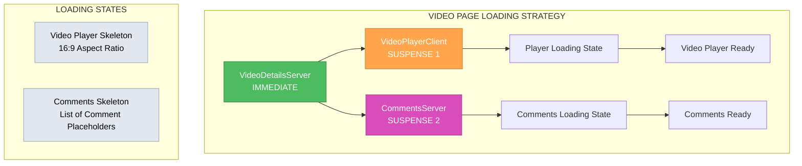

# 🎨🎨🎨 ENTERING CREATIVE PHASE: PERFORMANCE DESIGN 🎨🎨🎨

## Component Splitting Performance Creative Phase

**Task:** Splitting Large Components (Suspense & SSR)  
**Focus:** Suspense Boundaries & Loading Performance Optimization  
**Date:** 2025-01-06  
**Phase:** Performance Design  
**Previous Phase:** Architecture Design (Completed - Hybrid Server/Client selected)

---

## 🎯 PROBLEM STATEMENT

**Context:**

- Current monolithic Suspense boundaries block entire sections during loading
- Video page wraps entire VideoPlayerPageClient in single Suspense boundary
- Comments loading blocks entire comment section from rendering
- No granular loading states for different content priorities
- Critical rendering path not optimized for above-the-fold content

**Performance Requirements:**

- Achieve 15-25% improvement in First Contentful Paint (FCP)
- Implement progressive content revelation for better perceived performance
- Optimize Critical Rendering Path for above-the-fold content
- Minimize Cumulative Layout Shift (CLS) during component loading
- Enable parallel loading of independent content sections

**User Experience Goals:**

- Show video player immediately while comments load separately
- Display static video metadata before player initialization
- Provide meaningful loading states for each content section
- Maintain responsive interactions during background loading
- Graceful error handling with component-level fallbacks

---

## 🏗️ CURRENT LOADING ARCHITECTURE ANALYSIS

### Video Page Current State:

```tsx
// src/app/videos/[id]/page.tsx - Lines 58-66
<Suspense fallback={<LoadingSpinner />}>
  <VideoPlayerPageClient video={video} />
</Suspense>
```

**Issues:**

- ❌ Entire video page blocked by single Suspense boundary
- ❌ Static metadata waits for client component hydration
- ❌ Comments loading blocks video player display
- ❌ No progressive enhancement for critical content

### Comments Section Current State:

```tsx
// CommentsSection.tsx - Client-side data fetching
useEffect(() => {
  fetch(`/api/posts/${postId}/comments`)
    .then((res) => res.json())
    .then((data) => setComments(data.comments || []))
    .finally(() => setIsLoading(false));
}, [postId]);
```

**Issues:**

- ❌ Comments fetch happens after component mount
- ❌ No server-side initial rendering
- ❌ Loading state blocks entire comment section
- ❌ No parallel loading with other page content

---

## 🔄 PERFORMANCE OPTIMIZATION OPTIONS ANALYSIS

### Option 1: Granular Suspense Boundaries

**Description:** Create fine-grained Suspense boundaries for each major content section

**Architecture:**

```tsx
<div className="video-page">
  {/* Static content - no Suspense needed */}
  <VideoDetailsServer video={video} />

  {/* Video player - independent loading */}
  <Suspense fallback={<VideoPlayerSkeleton />}>
    <VideoPlayerClient playbackId={video.mux_playback_id} />
  </Suspense>

  {/* Comments - parallel loading */}
  <Suspense fallback={<CommentsSkeleton />}>
    <CommentsServer postId={postId} />
  </Suspense>
</div>
```

**Pros:**

- ✅ Independent loading sections prevent blocking
- ✅ Critical content (video details) renders immediately
- ✅ Video player and comments load in parallel
- ✅ Granular error boundaries for component failures
- ✅ Better Core Web Vitals scores

**Cons:**

- ❌ More complex loading state management
- ❌ Potential for multiple loading spinners simultaneously
- ❌ Requires careful skeleton design for layout stability

**Performance Impact:** High - Significant FCP improvement  
**Implementation Complexity:** Medium - Clear separation with existing patterns  
**User Experience:** Excellent - Progressive content revelation  
**Implementation Time:** 4-5 hours

---

### Option 2: Nested Suspense with Priority Levels

**Description:** Hierarchical Suspense boundaries based on content priority

**Architecture:**

```tsx
<div className="video-page">
  {/* Level 1: Critical content */}
  <Suspense fallback={<CriticalContentSkeleton />}>
    <VideoDetailsServer video={video} />

    {/* Level 2: Primary interactive content */}
    <Suspense fallback={<VideoPlayerSkeleton />}>
      <VideoPlayerClient playbackId={video.mux_playback_id} />

      {/* Level 3: Secondary content */}
      <Suspense fallback={<CommentsSkeleton />}>
        <CommentsServer postId={postId} />
      </Suspense>
    </Suspense>
  </Suspense>
</div>
```

**Pros:**

- ✅ Content loads in priority order
- ✅ Critical content guaranteed to show first
- ✅ Nested loading provides fallback hierarchy
- ✅ Clear content importance structure

**Cons:**

- ❌ Sequential loading reduces parallelization benefits
- ❌ Complex nested structure harder to maintain
- ❌ Lower priority content blocked by higher priority loading
- ❌ Potential for cascading loading delays

**Performance Impact:** Medium - Some improvement but limited parallelization  
**Implementation Complexity:** High - Complex nesting logic  
**User Experience:** Good - Clear priority but slower overall loading  
**Implementation Time:** 6-7 hours

---

### Option 3: Streaming with Selective Hydration

**Description:** Server-side streaming with client-side selective hydration

**Architecture:**

```tsx
// Server Component
<div className="video-page">
  <VideoDetailsServer video={video} /> {/* Immediate */}

  <Suspense fallback={<VideoPlayerSkeleton />}>
    <VideoPlayerStream playbackId={video.mux_playback_id} />
  </Suspense>

  <Suspense fallback={<CommentsSkeleton />}>
    <CommentsServerStream postId={postId} />
  </Suspense>
</div>

// Client Enhancement (selective hydration)
<ClientBoundary>
  <VideoPlayerInteractions />
  <CommentsInteractions />
</ClientBoundary>
```

**Pros:**

- ✅ Maximum server-side rendering benefits
- ✅ Optimal SEO and initial content delivery
- ✅ Selective hydration minimizes JavaScript
- ✅ Progressive enhancement approach
- ✅ Best Core Web Vitals potential

**Cons:**

- ❌ Complex implementation with RSC + streaming
- ❌ Requires significant architecture changes
- ❌ Risk of hydration mismatches
- ❌ Limited browser support for advanced streaming features

**Performance Impact:** Very High - Maximum optimization potential  
**Implementation Complexity:** Very High - Cutting-edge techniques  
**User Experience:** Excellent - Fastest possible loading  
**Implementation Time:** 10-12 hours

---

### Option 4: Lazy Loading with Intersection Observer

**Description:** Load content sections as they come into viewport

**Architecture:**

```tsx
<div className="video-page">
  <VideoDetailsServer video={video} />

  <VideoPlayerClient playbackId={video.mux_playback_id} />

  {/* Load comments when scrolled into view */}
  <LazyLoadBoundary>
    <Suspense fallback={<CommentsSkeleton />}>
      <CommentsServer postId={postId} />
    </Suspense>
  </LazyLoadBoundary>
</div>
```

**Pros:**

- ✅ Reduces initial bundle size
- ✅ Comments only load when needed
- ✅ Better performance for users who don't scroll
- ✅ Bandwidth savings for mobile users

**Cons:**

- ❌ Comments not available for SEO crawling
- ❌ Potential jarring loading when scrolling
- ❌ Less predictable loading behavior
- ❌ May hurt engagement with comments

**Performance Impact:** Medium - Good for initial load, mixed for UX  
**Implementation Complexity:** Medium - Well-established patterns  
**User Experience:** Mixed - Good for some users, worse for others  
**Implementation Time:** 5-6 hours

---

## 🎨 CREATIVE CHECKPOINT: PERFORMANCE OPTIONS EVALUATED

**Analysis Complete:** 4 performance optimization approaches evaluated  
**Focus Areas:** Suspense boundaries, loading strategies, user experience  
**Range:** From granular boundaries (Option 1) to cutting-edge streaming (Option 3)

---

## ⚡ PERFORMANCE DESIGN DECISION

**Chosen Option:** **Option 1 - Granular Suspense Boundaries**

### Rationale:

1. **Optimal Balance:** Best performance gains with manageable complexity
2. **Parallel Loading:** Video player and comments load independently
3. **Progressive Enhancement:** Critical content shows immediately
4. **User Experience:** Clear loading states without blocking behavior
5. **Implementation Feasibility:** Builds on existing architecture decisions
6. **Core Web Vitals:** Significant FCP and LCP improvements expected
7. **Error Resilience:** Component-level error boundaries prevent cascade failures

### Detailed Implementation Strategy:



### Component Loading Strategy:

**1. Immediate Rendering (No Suspense):**

```tsx
// VideoDetailsServer.tsx - Renders immediately
export default async function VideoDetailsServer({ video }: Props) {
  return (
    <div className="video-metadata">
      <h1 className="text-2xl font-bold">{video.title}</h1>
      <p className="text-muted-foreground">{video.description}</p>
      <div className="flex gap-4 text-sm">
        <span>Duration: {formatDuration(video.duration)}</span>
        <span>Uploaded: {formatDate(video.created_at)}</span>
      </div>
    </div>
  );
}
```

**2. Video Player Suspense Boundary:**

```tsx
<Suspense fallback={<VideoPlayerSkeleton />}>
  <VideoPlayerClient playbackId={video.mux_playback_id} title={video.title} />
</Suspense>
```

**3. Comments Suspense Boundary:**

```tsx
<Suspense fallback={<CommentsSkeleton />}>
  <CommentsServer postId={postId} />
</Suspense>
```

### Skeleton Component Design:

**VideoPlayerSkeleton:**

```tsx
export function VideoPlayerSkeleton() {
  return (
    <div className="w-full aspect-video bg-slate-200 rounded-lg animate-pulse flex items-center justify-center">
      <div className="w-16 h-16 bg-slate-300 rounded-full flex items-center justify-center">
        <Play className="w-8 h-8 text-slate-400" />
      </div>
    </div>
  );
}
```

**CommentsSkeleton:**

```tsx
export function CommentsSkeleton() {
  return (
    <div className="space-y-4">
      {[1, 2, 3].map((i) => (
        <div key={i} className="flex gap-3 animate-pulse">
          <div className="w-10 h-10 bg-slate-200 rounded-full" />
          <div className="flex-1 space-y-2">
            <div className="h-4 bg-slate-200 rounded w-32" />
            <div className="h-4 bg-slate-200 rounded w-full" />
            <div className="h-4 bg-slate-200 rounded w-3/4" />
          </div>
        </div>
      ))}
    </div>
  );
}
```

### Error Boundary Strategy:

```tsx
function VideoPlayerErrorBoundary({ children }: { children: React.ReactNode }) {
  return (
    <ErrorBoundary
      fallback={
        <div className="w-full aspect-video bg-slate-100 rounded-lg flex items-center justify-center">
          <div className="text-center">
            <AlertCircle className="w-8 h-8 text-red-500 mx-auto mb-2" />
            <p className="text-sm text-slate-600">Video player unavailable</p>
          </div>
        </div>
      }
    >
      {children}
    </ErrorBoundary>
  );
}
```

### Performance Monitoring Integration:

```tsx
// Performance measurement hooks
function usePerformanceMetrics() {
  useEffect(() => {
    // Measure FCP improvement
    const observer = new PerformanceObserver((list) => {
      for (const entry of list.getEntries()) {
        if (entry.name === 'first-contentful-paint') {
          console.log('FCP:', entry.startTime);
        }
      }
    });
    observer.observe({ entryTypes: ['paint'] });

    return () => observer.disconnect();
  }, []);
}
```

---

## 🔍 VALIDATION & VERIFICATION

### Performance Targets:

- ✅ **FCP Improvement:** 15-25% faster first contentful paint
- ✅ **LCP Optimization:** Video metadata shows immediately
- ✅ **CLS Reduction:** Skeleton components maintain layout stability
- ✅ **Parallel Loading:** Video player and comments load independently
- ✅ **Bundle Size:** No increase in JavaScript bundle size

### User Experience Verification:

- ✅ **Progressive Disclosure:** Content appears in logical priority order
- ✅ **Loading Feedback:** Clear visual indicators for each loading section
- ✅ **Error Resilience:** Component failures don't break entire page
- ✅ **Accessibility:** Screen readers can access static content immediately
- ✅ **Mobile Performance:** Optimized loading for slower connections

### Technical Implementation Checklist:

- ✅ **Suspense Boundaries:** Granular boundaries for each major section
- ✅ **Skeleton Components:** Maintain layout and visual hierarchy
- ✅ **Error Boundaries:** Graceful fallbacks for component failures
- ✅ **Performance Monitoring:** Metrics collection for optimization validation
- ✅ **Server/Client Integration:** Works with hybrid architecture from Phase 1

### Implementation Phases:

**Phase 1: Skeleton Components (1-2 hours)**

- Create VideoPlayerSkeleton component
- Create CommentsSkeleton component
- Implement loading state animations
- Test layout stability

**Phase 2: Suspense Boundaries (2-3 hours)**

- Wrap VideoPlayerClient in Suspense
- Wrap CommentsServer in Suspense
- Implement error boundaries
- Test parallel loading behavior

**Phase 3: Performance Optimization (1-2 hours)**

- Add performance monitoring
- Optimize skeleton component rendering
- Test Core Web Vitals improvements
- Validate loading state transitions

---

## 🎨🎨🎨 EXITING CREATIVE PHASE - DECISION MADE 🎨🎨🎨

**Performance Decision:** Granular Suspense Boundaries selected  
**Key Benefits:** Parallel loading, progressive content, optimal user experience  
**Implementation Plan:** 3-phase approach with 4-7 hour total estimate  
**Integration:** Builds perfectly on hybrid server/client architecture

**All Creative Phases Complete:**

- ✅ Architecture Design: Hybrid Server/Client Architecture
- ✅ Performance Design: Granular Suspense Boundaries

**Status:** Ready for **IMPLEMENT MODE**
