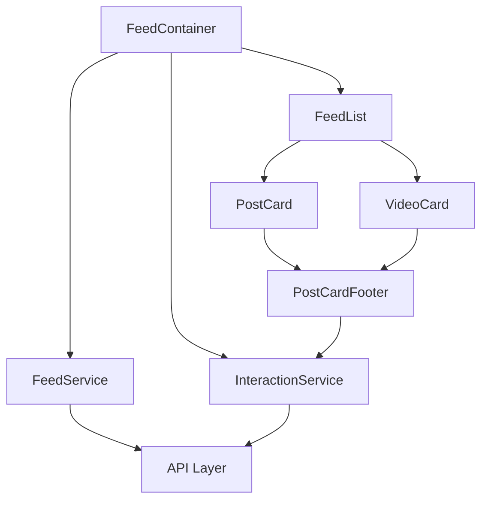
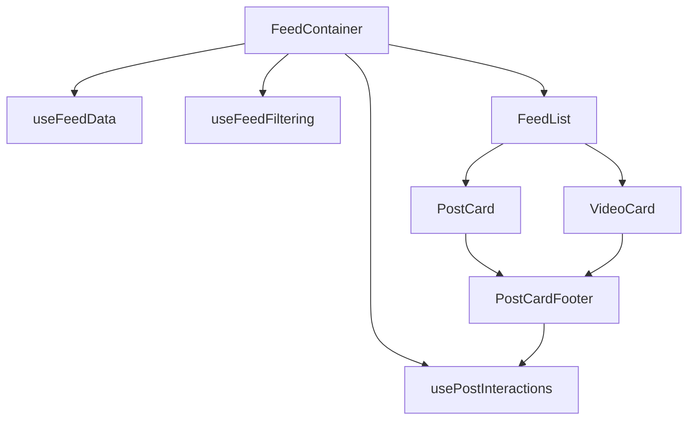
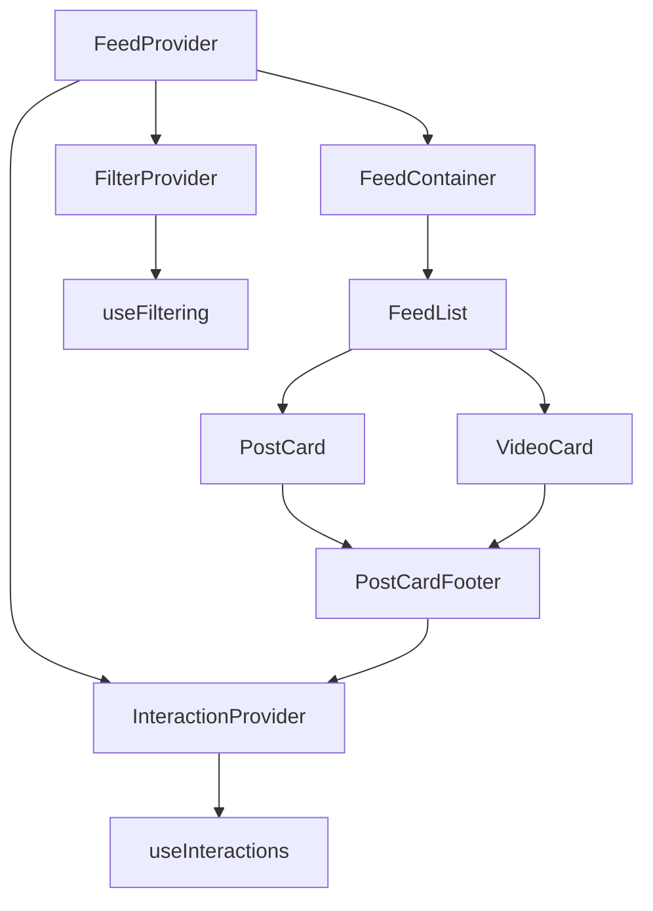
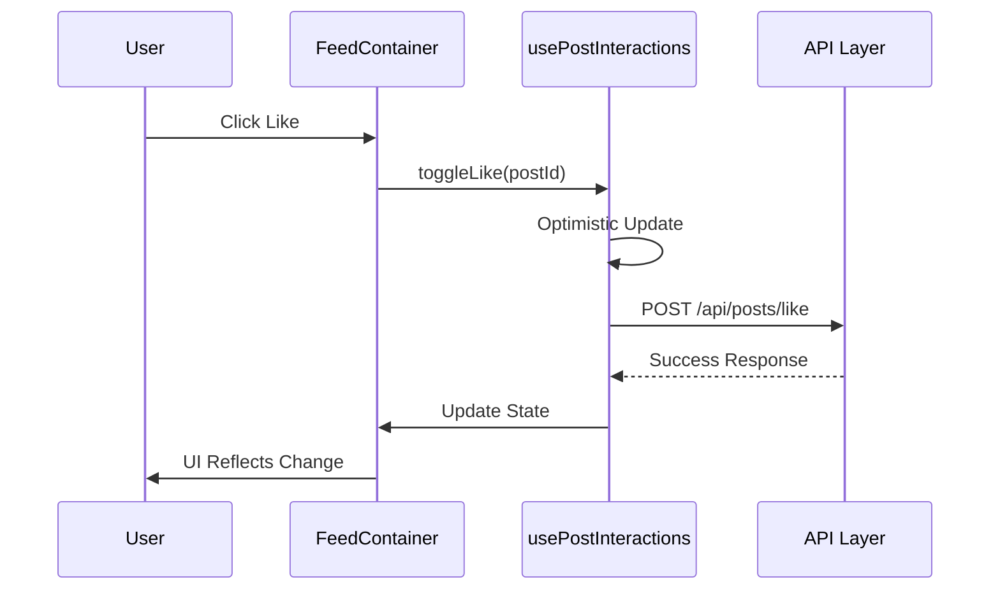

# 🎨🎨🎨 ENTERING CREATIVE PHASE: ARCHITECTURE DESIGN 🎨🎨🎨

## Creative Phase: Legacy Feed Component Architecture Design

**Date:** January 6, 2025  
**Component:** Legacy Feed Component Refactoring  
**Type:** Architecture Design Phase  
**Complexity:** Level 3 (Intermediate Feature)

## Architecture Challenge Definition

The current HomePageClient component is a monolithic 1500+ line component that handles multiple responsibilities: data fetching, state management, filtering, interaction handling, and UI rendering. This architecture creates maintenance challenges, performance bottlenecks, and makes it difficult to extend functionality. The challenge is to design a modular, performant, and maintainable architecture that leverages the unified post system while addressing the identified technical debt.

## System Requirements

### Functional Requirements

- **Feed Rendering**: Display mixed content (articles/videos) using unified PostCard/VideoCard components
- **Content Filtering**: Support "Posts" vs "Videos" filtering with smooth transitions
- **Interaction Management**: Handle likes, comments, bookmarks, shares with consistent state
- **Performance**: Maintain current performance while supporting larger feeds
- **Extensibility**: Enable easy addition of new content types and features

### Technical Constraints

- **Next.js 15**: Leverage App Router and Server Components where beneficial
- **React 18**: Use concurrent features and modern patterns
- **TypeScript**: Maintain strict type safety throughout
- **Existing Components**: Integrate with PostCard, VideoCard, and PostCardFooter
- **State Management**: Unify interaction state across components

### Performance Requirements

- **Initial Load**: < 2s for first meaningful paint
- **Interaction Response**: < 100ms for user interactions
- **Memory Usage**: Efficient handling of large feed datasets
- **Bundle Size**: Minimize JavaScript payload

## Component Analysis

### Current Architecture Issues

1. **Monolithic Component**: Single component handling too many responsibilities
2. **Inconsistent State**: Multiple state management approaches for interactions
3. **Client-Side Filtering**: Inefficient filtering of large datasets
4. **Duplicate Logic**: Repeated interaction handling across components
5. **Performance Bottlenecks**: Entire feed re-renders on any state change

### Core Components Identified

1. **FeedContainer**: Top-level orchestration and data management
2. **FeedList**: Optimized rendering of feed items
3. **FeedFilter**: Content type filtering interface
4. **FeedItem**: Individual post/video wrapper with interactions
5. **InteractionManager**: Centralized state management for user interactions

## Architecture Options

### Option 1: Layered Service Architecture

**Description**: Separate concerns into distinct layers with service-based state management



**Pros**:

- **Clear Separation**: Each layer has single responsibility
- **Testability**: Services can be unit tested independently
- **Reusability**: Services can be used across different contexts
- **State Consistency**: Centralized interaction state management
- **Performance**: Optimized data fetching and caching

**Cons**:

- **Complexity**: Additional abstraction layers
- **Learning Curve**: Team needs to understand service patterns
- **Over-engineering**: May be excessive for current requirements

**Technical Fit**: High  
**Complexity**: High  
**Scalability**: High

### Option 2: Hook-Based Composition Architecture

**Description**: Use custom hooks for state management with component composition



**Pros**:

- **React Patterns**: Leverages familiar React patterns
- **Composability**: Easy to combine and reuse hooks
- **Performance**: Built-in optimization with React features
- **Simplicity**: Straightforward to understand and maintain
- **Flexibility**: Easy to add new hooks for new features

**Cons**:

- **Hook Dependencies**: Complex dependency management between hooks
- **State Synchronization**: Potential issues with multiple hook states
- **Testing Complexity**: Hooks require specialized testing approaches

**Technical Fit**: High  
**Complexity**: Medium  
**Scalability**: Medium-High

### Option 3: Context-Based State Architecture

**Description**: Use React Context for global state with optimized providers



**Pros**:

- **Global State**: Easy access to state from any component
- **React Native**: Uses built-in React patterns
- **Provider Optimization**: Can optimize re-renders with multiple providers
- **Type Safety**: Strong TypeScript integration

**Cons**:

- **Performance Concerns**: Context changes trigger re-renders
- **Provider Hell**: Multiple nested providers can become unwieldy
- **Debugging Complexity**: State changes harder to trace

**Technical Fit**: Medium  
**Complexity**: Medium  
**Scalability**: Medium

## 🎨 CREATIVE CHECKPOINT: Performance Analysis

### Current Performance Issues

1. **Monolithic Re-renders**: Entire feed re-renders on any interaction
2. **Client-Side Filtering**: Inefficient for large datasets
3. **State Management**: Multiple state systems causing conflicts
4. **Memory Leaks**: Potential issues with large feed datasets

### Performance Optimization Strategies

1. **Component Memoization**: React.memo for feed items
2. **Virtual Scrolling**: For very large feeds
3. **Optimistic Updates**: Immediate UI feedback for interactions
4. **Server-Side Filtering**: Move filtering to API level
5. **State Normalization**: Efficient state structure

## Recommended Approach

**Selected Option**: **Option 2 - Hook-Based Composition Architecture**

### Rationale

After evaluating against the technical constraints and performance requirements, Option 2 provides the optimal balance:

1. **React Ecosystem Alignment**: Leverages React 18 features and patterns naturally
2. **Performance Benefits**: Built-in optimization with useMemo, useCallback, and React.memo
3. **Maintainability**: Familiar patterns for the development team
4. **Extensibility**: Easy to add new hooks for future features
5. **Testing**: Well-established patterns for testing custom hooks
6. **Type Safety**: Excellent TypeScript integration

### Implementation Architecture

#### 1. Core Hook Structure

```tsx
// Data Management
const useFeedData = (initialData) => {
  // Server state management with React Query or SWR
  // Pagination and infinite scroll logic
  // Error handling and loading states
};

// Interaction State
const usePostInteractions = () => {
  // Centralized like/bookmark/comment state
  // Optimistic updates
  // Server synchronization
};

// Filtering Logic
const useFeedFiltering = (items) => {
  // Client-side filtering with memoization
  // Filter state management
  // Performance optimization
};
```

#### 2. Component Hierarchy

```tsx
FeedContainer
├── FeedFilter (filter controls)
├── FeedList (virtualized list)
│   ├── PostCard (for articles)
│   └── VideoCard (for videos)
│       └── PostCardFooter (shared interactions)
└── FeedLoadingState (skeleton/spinner)
```

#### 3. State Management Flow



#### 4. Performance Optimizations

```tsx
// Memoized feed items
const FeedItem = React.memo(({ item, onInteraction }) => {
  return item.type === 'video' ? (
    <VideoCard video={item} />
  ) : (
    <PostCard post={item} />
  );
});

// Optimized filtering
const useFeedFiltering = (items, filter) => {
  return useMemo(() => {
    return items.filter((item) => filter === 'all' || item.type === filter);
  }, [items, filter]);
};
```

#### 5. Integration Points

- **PostCard Integration**: Pass interaction handlers via props
- **VideoCard Integration**: Ensure consistent interaction patterns
- **PostCardFooter**: Centralized interaction UI component
- **Server Actions**: Leverage Next.js 15 server actions for mutations

### Implementation Guidelines

#### Phase 1: Hook Extraction (Day 1)

1. Extract `useFeedData` from existing data fetching logic
2. Create `usePostInteractions` hook with current interaction patterns
3. Implement `useFeedFiltering` with memoization

#### Phase 2: Component Refactoring (Day 2)

1. Break down HomePageClient into smaller components
2. Implement FeedContainer with new hook composition
3. Create FeedList with PostCard/VideoCard integration

#### Phase 3: Optimization (Day 3)

1. Add React.memo to feed items
2. Implement optimistic updates in usePostInteractions
3. Add error boundaries and loading states

#### Phase 4: Testing & Polish (Day 4)

1. Unit tests for custom hooks
2. Integration tests for component interactions
3. Performance testing and optimization

### Verification Checkpoint

**Architecture Quality**:

- ✅ Single responsibility principle maintained
- ✅ Clear separation of concerns
- ✅ Reusable and composable patterns
- ✅ Performance optimizations included

**Technical Requirements**:

- ✅ Next.js 15 compatibility
- ✅ TypeScript safety maintained
- ✅ React 18 patterns utilized
- ✅ Existing component integration

**Scalability**:

- ✅ Easy to add new content types
- ✅ Extensible interaction patterns
- ✅ Performance scales with content volume
- ✅ Maintainable codebase structure

## 🎨🎨🎨 EXITING CREATIVE PHASE - ARCHITECTURE DECISION MADE 🎨🎨🎨

**Decision**: Implement Hook-Based Composition Architecture with custom hooks for data management, interactions, and filtering, integrated with existing PostCard/VideoCard components.

**Implementation Ready**: All architectural decisions made, ready for BUILD phase implementation.
