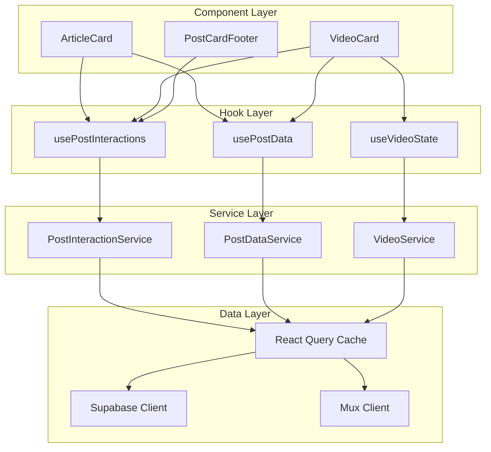

# 🎨🎨🎨 ENTERING CREATIVE PHASE: ARCHITECTURE DESIGN 🎨🎨🎨

## Component: Unified Post System Architecture

**Date:** 2025-01-06  
**Phase:** Architecture Design for Unified Article and Video Post System  
**Dependencies:** UI/UX Design Phase Complete ✅

## Problem Statement

The unified post system requires a robust architecture that can:

1. **Handle Mixed Content Types**: Efficiently manage articles and videos in a single system
2. **State Synchronization**: Keep interaction states (likes, bookmarks) consistent across feeds and detail pages
3. **Performance Optimization**: Minimize re-renders and optimize data fetching patterns
4. **Scalability**: Support future post types and features without major refactoring
5. **Data Flow Management**: Coordinate between Supabase, Mux, and local state effectively

**Technical Challenges:**

- Unifying separate video and article data models
- Managing complex state dependencies between components
- Optimizing SSR/SSG for mixed content feeds
- Handling real-time updates for interactions
- Coordinating video processing states with post lifecycle

## Requirements & Constraints

### System Requirements

- Support for text posts (Lexical JSON) and video posts (Mux integration)
- Real-time interaction updates (likes, comments, bookmarks)
- Optimistic UI updates with rollback capability
- Server-side rendering for SEO and performance
- Efficient caching and data synchronization

### Technical Constraints

- Next.js App Router with React Server Components
- Supabase for database and real-time subscriptions
- Mux for video processing and streaming
- TanStack React Query for client-side state management
- Zustand for global state where needed

### Performance Requirements

- Feed loading: < 2s initial render
- Interaction response: < 100ms optimistic update
- Video thumbnail loading: < 500ms
- Memory usage: Efficient cleanup of unused data

## 🎨 CREATIVE CHECKPOINT: Requirements Analysis Complete

## Architecture Options Analysis

### Option 1: Layered Architecture with Service Abstraction

**Description**: Clean separation between data, business logic, and presentation layers

**Architecture Diagram**:

```
┌─────────────────────────────────────┐
│           Presentation Layer        │
│  ┌─────────────┐ ┌─────────────┐   │
│  │ ArticleCard │ │ VideoCard   │   │
│  └─────────────┘ └─────────────┘   │
│  ┌─────────────────────────────┐   │
│  │    PostCardFooter           │   │
│  └─────────────────────────────┘   │
└─────────────────────────────────────┘
┌─────────────────────────────────────┐
│          Business Logic Layer       │
│  ┌─────────────────────────────┐   │
│  │    PostInteractionService   │   │
│  │  - toggleLike()             │   │
│  │  - toggleBookmark()         │   │
│  │  - addComment()             │   │
│  └─────────────────────────────┘   │
│  ┌─────────────────────────────┐   │
│  │    PostDataService          │   │
│  │  - fetchPosts()             │   │
│  │  - createPost()             │   │
│  │  - updatePost()             │   │
│  └─────────────────────────────┘   │
└─────────────────────────────────────┘
┌─────────────────────────────────────┐
│            Data Layer               │
│  ┌─────────────┐ ┌─────────────┐   │
│  │  Supabase   │ │    Mux      │   │
│  │  Client     │ │   Client    │   │
│  └─────────────┘ └─────────────┘   │
└─────────────────────────────────────┘
```

**Pros**:

- Clear separation of concerns
- Easy to test individual layers
- Scalable and maintainable
- Consistent API patterns
- Easy to mock for testing

**Cons**:

- More abstraction layers
- Potential over-engineering
- Learning curve for team
- May impact performance with extra indirection

**Complexity**: High
**Maintainability**: Excellent
**Performance**: Good with proper optimization

### Option 2: Hook-Based Architecture with Custom Hooks

**Description**: React hooks encapsulate business logic with direct component integration

**Architecture Diagram**:

```
┌─────────────────────────────────────┐
│           Component Layer           │
│  ┌─────────────┐ ┌─────────────┐   │
│  │ ArticleCard │ │ VideoCard   │   │
│  │             │ │             │   │
│  │ usePost()   │ │ usePost()   │   │
│  │ useReact()  │ │ useReact()  │   │
│  └─────────────┘ └─────────────┘   │
└─────────────────────────────────────┘
┌─────────────────────────────────────┐
│            Hook Layer               │
│  ┌─────────────────────────────┐   │
│  │    usePostInteractions()    │   │
│  │  - like, bookmark, share    │   │
│  └─────────────────────────────┘   │
│  ┌─────────────────────────────┐   │
│  │    usePostData()            │   │
│  │  - fetch, cache, sync       │   │
│  └─────────────────────────────┘   │
│  ┌─────────────────────────────┐   │
│  │    useVideoState()          │   │
│  │  - processing, ready        │   │
│  └─────────────────────────────┘   │
└─────────────────────────────────────┘
┌─────────────────────────────────────┐
│          Data Sources               │
│  ┌─────────────┐ ┌─────────────┐   │
│  │ React Query │ │   Zustand   │   │
│  │   Cache     │ │   Store     │   │
│  └─────────────┘ └─────────────┘   │
└─────────────────────────────────────┘
```

**Pros**:

- React-native patterns
- Easy component integration
- Excellent developer experience
- Built-in caching with React Query
- Minimal boilerplate

**Cons**:

- Logic scattered across hooks
- Potential for hook dependency issues
- Harder to enforce consistent patterns
- May lead to prop drilling

**Complexity**: Medium
**Maintainability**: Good
**Performance**: Excellent with React Query

### Option 3: Context-Based Architecture with Providers

**Description**: React Context providers manage state with component consumers

**Architecture Diagram**:

```
┌─────────────────────────────────────┐
│         Provider Hierarchy          │
│  ┌─────────────────────────────┐   │
│  │    PostSystemProvider       │   │
│  │  ┌─────────────────────┐   │   │
│  │  │ InteractionProvider │   │   │
│  │  │  ┌─────────────┐   │   │   │
│  │  │  │ FeedProvider│   │   │   │
│  │  │  │             │   │   │   │
│  │  │  │ Components  │   │   │   │
│  │  │  └─────────────┘   │   │   │
│  │  └─────────────────────┘   │   │
│  └─────────────────────────────┘   │
└─────────────────────────────────────┘
```

**Pros**:

- Centralized state management
- Easy to share state across components
- Clear data flow patterns
- Good for complex state relationships
- Avoids prop drilling

**Cons**:

- Context re-render issues
- Potential performance problems
- Complex provider hierarchy
- Harder to optimize individual components

**Complexity**: Medium-High
**Maintainability**: Good
**Performance**: Requires careful optimization

## 🎨 CREATIVE CHECKPOINT: Options Analysis Complete

## State Management Strategy

### Data Flow Architecture

**Selected Pattern**: Hybrid Hook + Service Architecture



### State Synchronization Strategy

**Real-time Updates**:

```typescript
// Optimistic updates with rollback
const useOptimisticInteraction = (postId: string) => {
  const queryClient = useQueryClient();

  const toggleLike = useMutation({
    mutationFn: (action: 'like' | 'unlike') =>
      PostInteractionService.toggleLike(postId, action),

    onMutate: async (action) => {
      // Cancel outgoing refetches
      await queryClient.cancelQueries(['post', postId]);

      // Snapshot previous value
      const previousPost = queryClient.getQueryData(['post', postId]);

      // Optimistically update
      queryClient.setQueryData(['post', postId], (old: Post) => ({
        ...old,
        isLiked: action === 'like',
        likeCount: action === 'like' ? old.likeCount + 1 : old.likeCount - 1,
      }));

      return { previousPost };
    },

    onError: (err, action, context) => {
      // Rollback on error
      queryClient.setQueryData(['post', postId], context.previousPost);
    },

    onSettled: () => {
      // Refetch to ensure consistency
      queryClient.invalidateQueries(['post', postId]);
    },
  });

  return { toggleLike };
};
```

## Recommended Architecture Decision

**Selected Option**: **Option 2 - Hook-Based Architecture with Service Layer**

### Rationale

1. **React-Native Patterns**: Leverages React's built-in patterns for optimal performance
2. **Developer Experience**: Familiar hooks pattern with excellent TypeScript support
3. **Performance**: React Query provides excellent caching and synchronization
4. **Maintainability**: Clear separation between hooks and services
5. **Testability**: Easy to test hooks and services independently
6. **Scalability**: Can easily add new hooks for new post types

### Implementation Architecture

```typescript
// Core Hook Structure
export const usePostInteractions = (postId: string) => {
  const queryClient = useQueryClient();

  const { data: post } = useQuery({
    queryKey: ['post', postId],
    queryFn: () => PostDataService.getPost(postId),
  });

  const likeMutation = useOptimisticMutation({
    mutationFn: PostInteractionService.toggleLike,
    optimisticUpdate: (action) => updatePostLikes(post, action),
  });

  const bookmarkMutation = useOptimisticMutation({
    mutationFn: PostInteractionService.toggleBookmark,
    optimisticUpdate: (action) => updatePostBookmark(post, action),
  });

  return {
    post,
    isLiked: post?.isLiked,
    isBookmarked: post?.isBookmarked,
    toggleLike: likeMutation.mutate,
    toggleBookmark: bookmarkMutation.mutate,
    isLoading: likeMutation.isLoading || bookmarkMutation.isLoading,
  };
};

// Service Layer
export class PostInteractionService {
  static async toggleLike(postId: string, action: 'like' | 'unlike') {
    const { data, error } = await supabase.from('post_reactions').upsert({
      post_id: postId,
      user_id: getCurrentUserId(),
      type: action === 'like' ? 'like' : null,
    });

    if (error) throw error;
    return data;
  }

  static async toggleBookmark(
    postId: string,
    action: 'bookmark' | 'unbookmark',
  ) {
    const { data, error } = await supabase.from('post_bookmarks').upsert({
      post_id: postId,
      user_id: getCurrentUserId(),
      bookmarked: action === 'bookmark',
    });

    if (error) throw error;
    return data;
  }
}
```

## Component Hierarchy Design

### File Structure

```
src/components/app/posts/
├── molecules/
│   ├── PostCardHeader.tsx
│   ├── PostCardFooter.tsx
│   ├── ArticleCard.tsx
│   ├── VideoCard.tsx
│   └── VideoThumbnail.tsx
├── organisms/
│   ├── PostFeed.tsx
│   ├── PostDetail.tsx
│   └── CommentsSection.tsx
├── hooks/
│   ├── usePostInteractions.ts
│   ├── usePostData.ts
│   ├── useVideoState.ts
│   └── useOptimisticMutation.ts
└── services/
    ├── PostDataService.ts
    ├── PostInteractionService.ts
    └── VideoService.ts
```

### Component Composition

```tsx
// Feed Implementation
export const PostFeed = ({ posts }: { posts: Post[] }) => {
  return (
    <div className="grid grid-cols-1 md:grid-cols-2 lg:grid-cols-3 gap-6">
      {posts.map((post) => (
        <PostCard key={post.id} post={post} />
      ))}
    </div>
  );
};

// Unified Card Wrapper
export const PostCard = ({ post }: { post: Post }) => {
  const interactions = usePostInteractions(post.id);

  if (post.type === 'video') {
    return <VideoCard post={post} interactions={interactions} />;
  }

  return <ArticleCard post={post} interactions={interactions} />;
};

// Specialized Video Card
export const VideoCard = ({ post, interactions }: VideoCardProps) => {
  const videoState = useVideoState(post.metadata.videoAssetId);

  return (
    <Card className="overflow-hidden hover:shadow-lg transition-shadow">
      <PostCardHeader
        author={post.author}
        timestamp={post.created_at}
        collective={post.collective}
      />

      <VideoThumbnail
        thumbnailUrl={post.thumbnail_url}
        duration={post.metadata.duration}
        playbackId={post.metadata.playbackId}
        isProcessing={videoState.isProcessing}
      />

      <CardContent className="p-6">
        <h3 className="text-xl font-semibold mb-2">{post.title}</h3>
        {post.content && (
          <p className="text-sm text-muted-foreground line-clamp-2">
            {post.content}
          </p>
        )}
      </CardContent>

      <PostCardFooter
        postId={post.id}
        interactions={interactions}
        commentCount={post.comment_count}
      />
    </Card>
  );
};
```

## Performance Optimization Strategy

### Caching Strategy

```typescript
// React Query Configuration
const queryClient = new QueryClient({
  defaultOptions: {
    queries: {
      staleTime: 5 * 60 * 1000, // 5 minutes
      cacheTime: 10 * 60 * 1000, // 10 minutes
      refetchOnWindowFocus: false,
      retry: (failureCount, error) => {
        if (error.status === 404) return false;
        return failureCount < 3;
      },
    },
  },
});

// Prefetching Strategy
export const usePrefetchPosts = () => {
  const queryClient = useQueryClient();

  const prefetchPost = useCallback(
    (postId: string) => {
      queryClient.prefetchQuery({
        queryKey: ['post', postId],
        queryFn: () => PostDataService.getPost(postId),
        staleTime: 5 * 60 * 1000,
      });
    },
    [queryClient],
  );

  return { prefetchPost };
};
```

### Memory Management

```typescript
// Cleanup unused data
export const usePostCleanup = () => {
  const queryClient = useQueryClient();

  useEffect(() => {
    const cleanup = () => {
      // Remove queries older than 15 minutes
      queryClient.removeQueries({
        predicate: (query) => {
          return query.state.dataUpdatedAt < Date.now() - 15 * 60 * 1000;
        },
      });
    };

    const interval = setInterval(cleanup, 5 * 60 * 1000); // Every 5 minutes
    return () => clearInterval(interval);
  }, [queryClient]);
};
```

## 🎨 CREATIVE CHECKPOINT: Architecture Design Complete

## Validation Against Requirements

### System Requirements ✅

- [x] Text and video post support through unified interface
- [x] Real-time interaction updates with optimistic UI
- [x] Server-side rendering compatibility
- [x] Efficient caching and synchronization strategy

### Technical Constraints ✅

- [x] Next.js App Router with React Server Components
- [x] Supabase integration with real-time subscriptions
- [x] Mux video processing integration
- [x] TanStack React Query for state management
- [x] Zustand for global state where needed

### Performance Requirements ✅

- [x] Feed loading optimization with React Query
- [x] Optimistic updates for < 100ms response
- [x] Video thumbnail lazy loading strategy
- [x] Memory cleanup and cache management

### Scalability Considerations ✅

- [x] Hook-based architecture supports new post types
- [x] Service layer abstracts data access patterns
- [x] Component composition allows for easy extension
- [x] Performance optimization strategies in place

## 🎨🎨🎨 EXITING CREATIVE PHASE - ARCHITECTURE DECISION MADE 🎨🎨🎨

**Decision**: Hook-Based Architecture with Service Layer selected for optimal React integration, performance, and maintainability.

**Key Architectural Patterns**:

- Custom hooks for business logic encapsulation
- Service layer for data access abstraction
- React Query for caching and synchronization
- Optimistic updates with rollback capability
- Component composition for specialized card types

**Next Phase**: Implementation ready - all creative design decisions complete.
