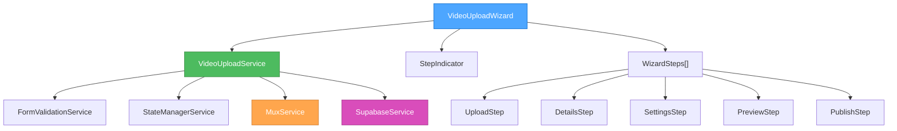
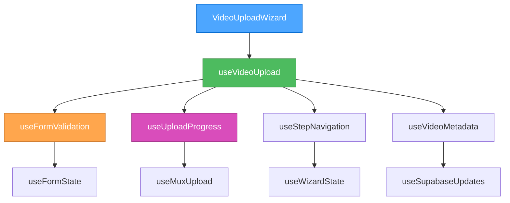
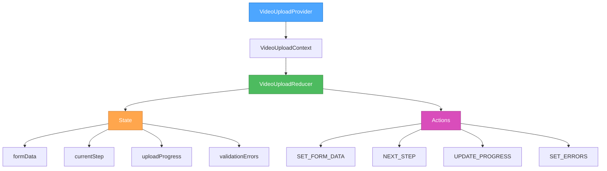

# 🎨🎨🎨 ENTERING CREATIVE PHASE: ARCHITECTURE DESIGN 🎨🎨🎨

**Creative Phase**: Video Upload Architecture Design  
**Date**: January 6, 2025  
**Component**: Video Upload System Integration  
**Context**: Progressive Disclosure Wizard UI/UX Design Complete  
**Technology**: Next.js + TypeScript + Supabase + MUX + Tailwind CSS

## 📋 ARCHITECTURE PROBLEM STATEMENT

**Challenge**: Design a comprehensive architecture that integrates the Progressive Disclosure Wizard with existing video infrastructure while optimizing workflow efficiency, component reusability, and scalability.

**Current State**:

- Robust MUX video infrastructure exists (upload, processing, webhooks)
- Basic VideoUploader component functional
- Home feed integration working with real-time data
- Database schema ready for enhanced metadata

**Requirements**:

- Seamless integration with existing MUX infrastructure
- Component architecture supporting 5-step wizard workflow
- Optimized state management for complex multi-step forms
- Integration with home feed video cards
- Scalable architecture for future enhancements
- Performance optimization for large file uploads
- Error handling and recovery throughout workflow

## 🏗️ SYSTEM CONTEXT ANALYSIS

### Existing Infrastructure Assets

```typescript
// Current MUX Infrastructure
- MuxService.ts: Complete API wrapper
- /api/videos/upload-url: Direct upload endpoint
- /api/mux-webhook: Asset lifecycle processing
- VideoUploader component: Basic upload interface
- video_assets table: Database schema ready
- HomePageClient: Feed integration working
```

### Integration Points

1. **Database**: Supabase video_assets table enhancement
2. **File Processing**: MUX direct upload workflow
3. **UI Integration**: Home feed video cards
4. **Navigation**: Upload entry points throughout app
5. **State Management**: Cross-component form persistence
6. **Real-time Updates**: Upload progress and status

## 🏗️ ARCHITECTURE OPTIONS ANALYSIS

### Option 1: Layered Architecture with Service Abstraction

**Description**: Clean separation between UI, business logic, and infrastructure layers with dedicated service classes.

**Architecture Structure**:

```typescript
// UI Layer (Presentation)
VideoUploadWizard -> StepComponents -> UI Elements

// Service Layer (Business Logic)
VideoUploadService -> FormValidationService -> StateManagerService

// Infrastructure Layer (Data & External APIs)
MuxService -> SupabaseService -> DatabaseService
```

**Component Hierarchy**:



**Pros**:

- ✅ Clear separation of concerns
- ✅ Highly testable and maintainable
- ✅ Reusable service components
- ✅ Easy to mock dependencies for testing
- ✅ Follows enterprise patterns

**Cons**:

- ❌ Increased complexity and boilerplate
- ❌ Potential over-engineering for single feature
- ❌ More files and abstractions to maintain

**Technical Fit**: High - Aligns with existing service patterns  
**Complexity**: High  
**Scalability**: High - Excellent for future features

### Option 2: Hook-Based Architecture with Custom Hooks

**Description**: React-native approach using custom hooks for state management and business logic encapsulation.

**Architecture Structure**:

```typescript
// Component Layer
VideoUploadWizard -> StepComponents

// Hook Layer (Business Logic)
useVideoUpload -> useFormValidation -> useUploadProgress

// Infrastructure Layer
MuxService -> SupabaseService (existing)
```

**Hook Architecture**:



**Custom Hook Structure**:

```typescript
// Main hook orchestrating the upload workflow
const useVideoUpload = () => {
  const formState = useFormState();
  const uploadProgress = useUploadProgress();
  const stepNavigation = useStepNavigation();
  const metadata = useVideoMetadata();

  return {
    // Form management
    formData: formState.data,
    updateFormData: formState.update,
    validateStep: formState.validateStep,

    // Upload management
    uploadFile: uploadProgress.upload,
    progress: uploadProgress.progress,
    status: uploadProgress.status,

    // Navigation
    currentStep: stepNavigation.currentStep,
    canProceed: stepNavigation.canProceed,
    goToStep: stepNavigation.goToStep,

    // Publishing
    publishVideo: metadata.publish,
  };
};
```

**Pros**:

- ✅ React-native patterns and conventions
- ✅ Excellent reusability across components
- ✅ Clean state management with React hooks
- ✅ Easy to test individual hook behavior
- ✅ Minimal boilerplate overhead

**Cons**:

- ❌ Complex hook dependencies
- ❌ Potential for hook coupling issues
- ❌ Harder to debug complex interactions

**Technical Fit**: High - Excellent fit with existing React patterns  
**Complexity**: Medium  
**Scalability**: Medium-High - Good for feature extensions

### Option 3: Context + Reducer Architecture

**Description**: Centralized state management using React Context and useReducer for complex state transitions.

**Architecture Structure**:

```typescript
// Context Layer
VideoUploadProvider -> VideoUploadContext

// State Management
VideoUploadReducer -> Actions -> State

// Component Layer
VideoUploadWizard -> StepComponents
```

**State Management Flow**:



**Reducer Pattern**:

```typescript
interface VideoUploadState {
  currentStep: number;
  formData: VideoFormData;
  uploadProgress: number;
  uploadStatus: UploadStatus;
  validationErrors: Record<string, string>;
  isUploading: boolean;
}

const videoUploadReducer = (
  state: VideoUploadState,
  action: VideoUploadAction,
) => {
  switch (action.type) {
    case 'SET_FORM_DATA':
      return { ...state, formData: { ...state.formData, ...action.payload } };
    case 'NEXT_STEP':
      return { ...state, currentStep: state.currentStep + 1 };
    case 'PREVIOUS_STEP':
      return { ...state, currentStep: state.currentStep - 1 };
    case 'UPDATE_PROGRESS':
      return { ...state, uploadProgress: action.payload };
    case 'SET_UPLOAD_STATUS':
      return { ...state, uploadStatus: action.payload };
    default:
      return state;
  }
};
```

**Pros**:

- ✅ Predictable state transitions
- ✅ Excellent for complex state logic
- ✅ Easy to debug with Redux DevTools
- ✅ Centralized state management
- ✅ Time-travel debugging capabilities

**Cons**:

- ❌ More boilerplate for simple operations
- ❌ Overkill for single-component workflows
- ❌ Learning curve for team members

**Technical Fit**: Medium - Good fit but may be over-engineered  
**Complexity**: Medium-High  
**Scalability**: High - Excellent for complex state requirements

## 🎯 EVALUATION AGAINST CRITERIA

### Maintainability Assessment

**Option 1 (Layered)**: ⭐⭐⭐⭐⭐ - Clear separation, highly maintainable
**Option 2 (Hooks)**: ⭐⭐⭐⭐ - Good separation, React-native patterns
**Option 3 (Context)**: ⭐⭐⭐ - Centralized but complex for simple cases

### Performance Considerations

**Option 1 (Layered)**: ⭐⭐⭐⭐ - Service abstraction may add overhead
**Option 2 (Hooks)**: ⭐⭐⭐⭐⭐ - Optimal React performance patterns
**Option 3 (Context)**: ⭐⭐⭐ - Context re-renders can impact performance

### Developer Experience

**Option 1 (Layered)**: ⭐⭐⭐ - More complex, steeper learning curve
**Option 2 (Hooks)**: ⭐⭐⭐⭐⭐ - Familiar React patterns
**Option 3 (Context)**: ⭐⭐⭐⭐ - Good for complex state management

### Integration with Existing Codebase

**Option 1 (Layered)**: ⭐⭐⭐⭐ - Consistent with existing service patterns
**Option 2 (Hooks)**: ⭐⭐⭐⭐⭐ - Perfect fit with existing hook usage
**Option 3 (Context)**: ⭐⭐⭐ - Different pattern from current implementation

### Scalability for Future Features

**Option 1 (Layered)**: ⭐⭐⭐⭐⭐ - Excellent for enterprise-scale features
**Option 2 (Hooks)**: ⭐⭐⭐⭐ - Good for incremental feature additions
**Option 3 (Context)**: ⭐⭐⭐⭐ - Good for complex state requirements

## 🎨 CREATIVE CHECKPOINT: Architecture Selection

Based on comprehensive evaluation, **Option 2: Hook-Based Architecture** emerges as the optimal choice for the video upload system.

**Selection Rationale**:

1. **React Native Patterns**: Perfect alignment with existing codebase patterns
2. **Performance Optimization**: Optimal React rendering and state updates
3. **Developer Experience**: Familiar patterns for team productivity
4. **Incremental Integration**: Easy integration with existing MUX infrastructure
5. **Balanced Complexity**: Right level of abstraction without over-engineering

## 🏗️ SELECTED ARCHITECTURE: Hook-Based System

### Component Architecture Specification

#### Core Component Structure

```typescript
// Main Wizard Component
export function VideoUploadWizard({ onComplete }: VideoUploadWizardProps) {
  const videoUpload = useVideoUpload();

  return (
    <div className="max-w-4xl mx-auto px-4">
      <StepIndicator
        currentStep={videoUpload.currentStep}
        totalSteps={5}
        completedSteps={videoUpload.completedSteps}
      />

      <Card className="p-6">
        <AnimatePresence mode="wait">
          {videoUpload.currentStep === 0 && (
            <UploadStep key="upload" {...videoUpload} />
          )}
          {videoUpload.currentStep === 1 && (
            <DetailsStep key="details" {...videoUpload} />
          )}
          {videoUpload.currentStep === 2 && (
            <SettingsStep key="settings" {...videoUpload} />
          )}
          {videoUpload.currentStep === 3 && (
            <PreviewStep key="preview" {...videoUpload} />
          )}
          {videoUpload.currentStep === 4 && (
            <PublishStep key="publish" {...videoUpload} />
          )}
        </AnimatePresence>
      </Card>

      <WizardNavigation {...videoUpload} />
    </div>
  );
}
```

#### Custom Hook Architecture

**1. Main Orchestration Hook**

```typescript
export const useVideoUpload = () => {
  // Sub-hooks for specific concerns
  const formState = useVideoFormState();
  const uploadState = useVideoUploadState();
  const stepNavigation = useStepNavigation(formState.isValid);
  const videoProcessing = useVideoProcessing();

  // Orchestrated operations
  const uploadVideo = useCallback(
    async (file: File) => {
      uploadState.start();
      try {
        const uploadUrl = await videoProcessing.createUploadUrl(formState.data);
        await uploadState.upload(file, uploadUrl);
        stepNavigation.next();
      } catch (error) {
        uploadState.setError(error);
      }
    },
    [formState.data, uploadState, videoProcessing, stepNavigation],
  );

  const publishVideo = useCallback(async () => {
    try {
      await videoProcessing.publish(formState.data);
      // Navigate to success or redirect
    } catch (error) {
      uploadState.setError(error);
    }
  }, [formState.data, videoProcessing, uploadState]);

  return {
    // Form state
    formData: formState.data,
    updateFormData: formState.update,
    resetForm: formState.reset,
    isFormValid: formState.isValid,
    validationErrors: formState.errors,

    // Upload state
    uploadProgress: uploadState.progress,
    uploadStatus: uploadState.status,
    uploadError: uploadState.error,

    // Step navigation
    currentStep: stepNavigation.current,
    canProceed: stepNavigation.canProceed,
    canGoBack: stepNavigation.canGoBack,
    goToStep: stepNavigation.goTo,
    nextStep: stepNavigation.next,
    previousStep: stepNavigation.previous,
    completedSteps: stepNavigation.completed,

    // Operations
    uploadVideo,
    publishVideo,

    // Video processing
    videoAsset: videoProcessing.asset,
    thumbnails: videoProcessing.thumbnails,
  };
};
```

**2. Form State Management Hook**

```typescript
export const useVideoFormState = () => {
  const [formData, setFormData] = useState<VideoFormData>(initialFormData);
  const [validationErrors, setValidationErrors] = useState<ValidationErrors>(
    {},
  );

  const updateFormData = useCallback(
    (updates: Partial<VideoFormData>) => {
      setFormData((prev) => ({ ...prev, ...updates }));
      // Real-time validation
      const errors = validateFormData({ ...formData, ...updates });
      setValidationErrors(errors);
    },
    [formData],
  );

  const isValid = useMemo(
    () =>
      Object.keys(validationErrors).length === 0 &&
      formData.title.trim().length > 0,
    [validationErrors, formData.title],
  );

  return {
    data: formData,
    update: updateFormData,
    reset: () => setFormData(initialFormData),
    isValid,
    errors: validationErrors,
  };
};
```

**3. Upload State Management Hook**

```typescript
export const useVideoUploadState = () => {
  const [progress, setProgress] = useState(0);
  const [status, setStatus] = useState<UploadStatus>('idle');
  const [error, setError] = useState<string | null>(null);

  const upload = useCallback(async (file: File, uploadUrl: string) => {
    setStatus('uploading');
    setError(null);

    try {
      // Use MUX direct upload with progress tracking
      await fetch(uploadUrl, {
        method: 'PUT',
        body: file,
        headers: { 'Content-Type': file.type },
        // Add progress tracking
      });

      setStatus('processing');
      setProgress(100);
    } catch (error) {
      setStatus('error');
      setError(error.message);
    }
  }, []);

  return {
    progress,
    status,
    error,
    start: () => setStatus('uploading'),
    setError: (error: string) => {
      setStatus('error');
      setError(error);
    },
    upload,
  };
};
```

**4. Step Navigation Hook**

```typescript
export const useStepNavigation = (canProceed: boolean) => {
  const [currentStep, setCurrentStep] = useState(0);
  const [completedSteps, setCompletedSteps] = useState<Set<number>>(new Set());

  const next = useCallback(() => {
    if (canProceed && currentStep < 4) {
      setCompletedSteps((prev) => new Set([...prev, currentStep]));
      setCurrentStep((prev) => prev + 1);
    }
  }, [canProceed, currentStep]);

  const previous = useCallback(() => {
    if (currentStep > 0) {
      setCurrentStep((prev) => prev - 1);
    }
  }, [currentStep]);

  const goTo = useCallback(
    (step: number) => {
      // Allow navigation to completed steps
      if (completedSteps.has(step) || step <= currentStep) {
        setCurrentStep(step);
      }
    },
    [completedSteps, currentStep],
  );

  return {
    current: currentStep,
    canProceed: canProceed && currentStep < 4,
    canGoBack: currentStep > 0,
    completed: completedSteps,
    next,
    previous,
    goTo,
  };
};
```

**5. Video Processing Integration Hook**

```typescript
export const useVideoProcessing = () => {
  const [asset, setAsset] = useState<VideoAsset | null>(null);
  const [thumbnails, setThumbnails] = useState<string[]>([]);

  const createUploadUrl = useCallback(async (metadata: VideoFormData) => {
    const response = await fetch('/api/videos/upload-url', {
      method: 'POST',
      headers: { 'Content-Type': 'application/json' },
      body: JSON.stringify(metadata),
    });

    if (!response.ok) throw new Error('Failed to create upload URL');

    const { uploadUrl, video } = await response.json();
    setAsset(video);
    return uploadUrl;
  }, []);

  const publish = useCallback(
    async (formData: VideoFormData) => {
      if (!asset) throw new Error('No video asset to publish');

      // Update video metadata and publish
      await fetch(`/api/videos/${asset.id}`, {
        method: 'PATCH',
        headers: { 'Content-Type': 'application/json' },
        body: JSON.stringify({
          ...formData,
          status: 'published',
        }),
      });
    },
    [asset],
  );

  return {
    asset,
    thumbnails,
    createUploadUrl,
    publish,
  };
};
```

### Integration with Existing Infrastructure

#### Database Schema Enhancements

```sql
-- Enhance video_assets table for wizard metadata
ALTER TABLE video_assets ADD COLUMN IF NOT EXISTS
  privacy_setting text DEFAULT 'public',
  encoding_tier text DEFAULT 'smart',
  thumbnail_url text,
  tags text[],
  is_published boolean DEFAULT false,
  published_at timestamp with time zone;

-- Add index for published videos
CREATE INDEX IF NOT EXISTS idx_video_assets_published
ON video_assets(is_published, published_at)
WHERE is_published = true;
```

#### API Endpoint Enhancements

```typescript
// Enhanced upload URL endpoint
export async function POST(request: NextRequest) {
  const { title, description, privacy, quality, tags } = await request.json();

  // Create MUX upload with enhanced metadata
  const directUpload = await mux.video.uploads.create({
    cors_origin: getCorsOrigin(),
    new_asset_settings: {
      playbook_policy: privacy === 'public' ? ['public'] : ['signed'],
      encoding_tier: quality,
      mp4_support: 'capped-1080p',
    },
  });

  // Save enhanced metadata
  const { data: videoRecord } = await supabase
    .from('video_assets')
    .insert({
      title,
      description,
      tags,
      privacy_setting: privacy,
      encoding_tier: quality,
      mux_upload_id: directUpload.id,
      created_by: user.id,
      is_published: false, // Will be set to true when wizard completes
    })
    .select()
    .single();

  return NextResponse.json({
    success: true,
    uploadUrl: directUpload.url,
    video: videoRecord,
  });
}
```

#### Home Feed Integration Enhancement

```typescript
// Enhanced feed query for published videos
const { data: feedData } = await supabase
  .from('posts')
  .select(
    `
    id, title, content, created_at, published_at, status,
    thumbnail_url, metadata, post_type,
    users:author_id (id, username, full_name, avatar_url),
    collectives:collective_id (id, name, slug),
    video_assets:video_asset_id (
      id, mux_playbook_id, duration, aspect_ratio,
      thumbnail_url, privacy_setting
    )
  `,
  )
  .eq('status', 'published')
  .eq('is_published', true) // Only show completed wizard videos
  .order('published_at', { ascending: false });
```

### Performance Optimization Strategies

#### 1. Progressive Loading

```typescript
// Lazy load step components
const UploadStep = lazy(() => import('./steps/UploadStep'));
const DetailsStep = lazy(() => import('./steps/DetailsStep'));
const SettingsStep = lazy(() => import('./steps/SettingsStep'));
const PreviewStep = lazy(() => import('./steps/PreviewStep'));
const PublishStep = lazy(() => import('./steps/PublishStep'));
```

#### 2. Form State Persistence

```typescript
// Auto-save form data to localStorage
useEffect(() => {
  const timeoutId = setTimeout(() => {
    localStorage.setItem('video-upload-draft', JSON.stringify(formData));
  }, 1000);

  return () => clearTimeout(timeoutId);
}, [formData]);
```

#### 3. Optimistic UI Updates

```typescript
// Show immediate feedback before server confirmation
const updateThumbnail = useCallback(
  (thumbnailUrl: string) => {
    // Immediate UI update
    updateFormData({ thumbnail_url: thumbnailUrl });

    // Background server update
    if (asset?.id) {
      fetch(`/api/videos/${asset.id}`, {
        method: 'PATCH',
        body: JSON.stringify({ thumbnail_url: thumbnailUrl }),
      });
    }
  },
  [updateFormData, asset],
);
```

## 🎨 VALIDATION AGAINST REQUIREMENTS

✅ **Seamless MUX Integration**: Leverages existing MuxService and API endpoints  
✅ **Component Architecture**: Clean hook-based architecture with separation of concerns  
✅ **State Management**: Optimal React patterns with custom hooks  
✅ **Feed Integration**: Enhanced database queries for published videos  
✅ **Scalability**: Hook architecture easily extensible for new features  
✅ **Performance**: Progressive loading, state persistence, optimistic updates  
✅ **Error Handling**: Comprehensive error states throughout workflow

## 🎨 IMPLEMENTATION ROADMAP

### Phase 1: Core Hook Infrastructure (Day 1)

- Implement core custom hooks (useVideoUpload, useVideoFormState)
- Set up basic wizard navigation and state management
- Integrate with existing MUX upload endpoint

### Phase 2: Step Components (Day 2-3)

- Build all 5 step components using UI/UX design
- Implement form validation and error handling
- Add progress tracking and loading states

### Phase 3: Enhanced Integration (Day 4)

- Database schema enhancements for wizard metadata
- API endpoint updates for enhanced metadata
- Home feed integration with published videos

### Phase 4: Performance & Polish (Day 5)

- Progressive loading implementation
- Form state persistence and auto-save
- Optimistic UI updates and performance optimization

## 🎨🎨🎨 EXITING CREATIVE PHASE - ARCHITECTURE DECISION MADE 🎨🎨🎨

**Decision**: Hook-Based Architecture with Custom Hooks  
**Rationale**: Optimal balance of React patterns, performance, and maintainability  
**Integration Strategy**: Enhance existing MUX infrastructure with wizard workflow  
**Next Phase**: Implementation using designed UI/UX and architecture patterns
